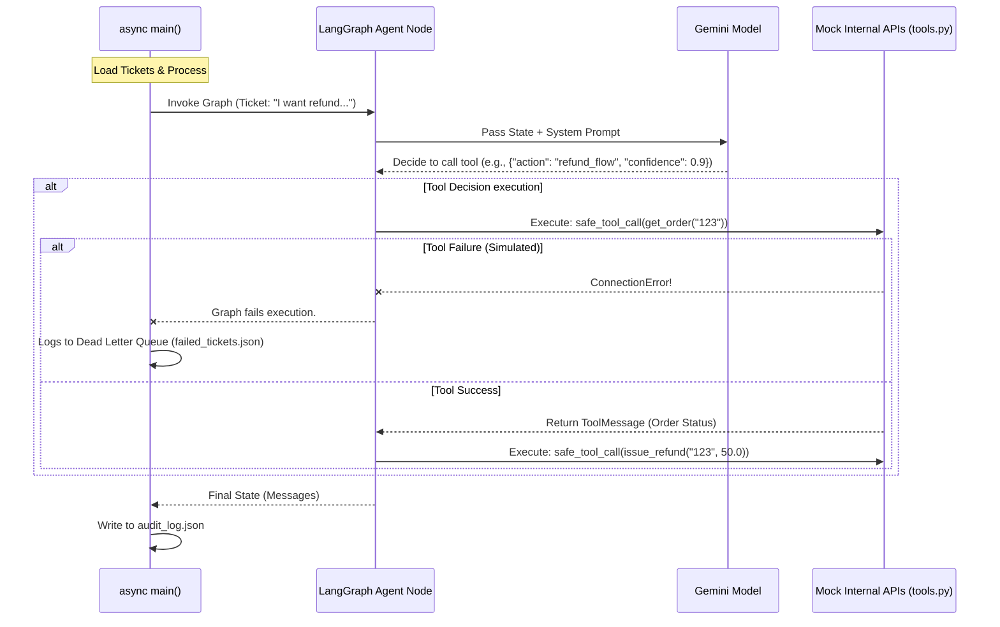

# Architecture Diagram

## Abstract View
                ┌──────────────┐
                │   Tickets    │
                └──────┬───────┘
                       ↓
              ┌─────────────────┐
              │  LLM Decision   │
              └──────┬──────────┘
                     ↓
        ┌────────────┼────────────┐
        ↓            ↓            ↓
   Refund Flow   Order Tracking   KB Search
        ↓            ↓            ↓
              ┌─────────────────┐
              │   Observation   │
              └──────┬──────────┘
                     ↓
        ┌────────────┼────────────┐
        ↓                         ↓
     Resolve                 Escalate
        ↓                         ↓
              ┌─────────────────┐
              │   Send Reply    │
              └─────────────────┘
