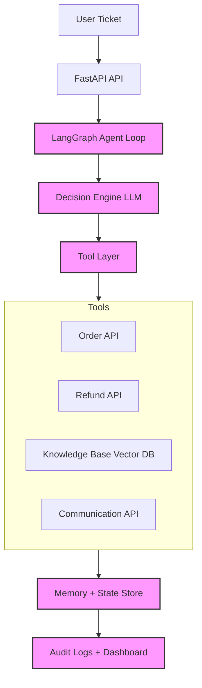

# Autonomous Support Resolution Agent

## 🧩 Diagram Flow

## 📝 Key Architecture Labels (IMPORTANT)

* **“Multi-step reasoning”** - Empowering the agent to process complex requests beyond simple query-response.
* **“Tool chaining”** - Allowing the agent to sequentially execute multiple tools to achieve a final resolution.
* **“Failure handling”** - Robust dead letter queues and fallback mechanisms to ensure system stability.
* **“Concurrency enabled”** - Processing multiple tickets simultaneously for production-grade throughput.
* **“Explainable AI logs”** - Transparent audit trails capturing the agent's step-by-step decision process.
